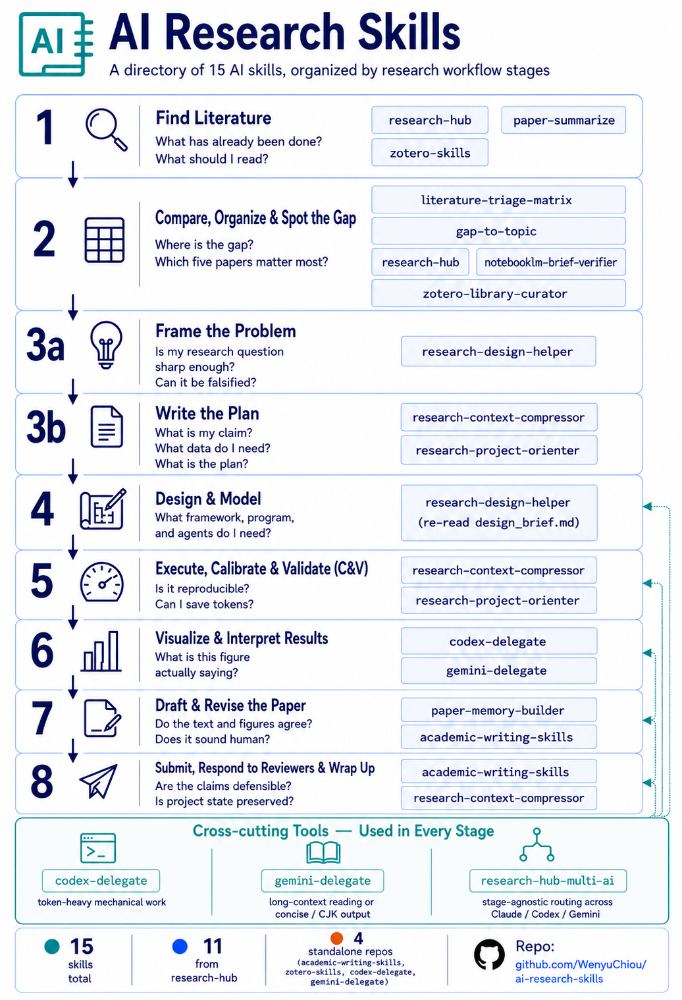

# AI Research Skills

> **Stop asking AI to reread your research project from scratch every
> session. Give it skills.**

A researcher-facing catalog of **13 verified AI skills** that cover the
full research workflow — from finding the first paper to submitting the
final manuscript.

Languages: [English](README.md) | [繁中](README.zh-TW.md)



**What you get:** 13 skills covering the full research workflow.
**Verification status:** 11 of 13 verified end-to-end (T1) against a
real research workspace (1100+ papers in Zotero, live NotebookLM, real
manuscript audits); 2 of 13 verified at the binary / CLI layer (T2);
0 unverified. See [docs/verification.md](docs/verification.md) for the
per-skill matrix. **Distribution:** 9 skills come from one install
(`research-hub-pipeline`); 4 are standalone clones.

**Who this is for:** graduate students, PhD researchers, postdocs,
research engineers, librarians, and research support staff who run real
research projects with AI in the loop.

**How skills actually work:** each skill is a Markdown instruction file
(`SKILL.md`) installed under `~/.claude/skills/`. AI hosts that
support skills (Claude Code, Cursor with the Claude Code extension,
etc.) automatically read and apply them when your request matches the
skill's trigger description. **Skills are not CLI tools or Python
packages** — they're prompt scaffolding the host loads on your behalf.

---

## 10-Minute First Try

Want to feel what this catalog does before reading the rest?

**Prerequisite:** Claude Code installed — see https://claude.ai/code.
The skills below activate inside a Claude Code conversation.

**Realistic time:** ~10 min the first time (Claude Code login +
research-hub install + paper search + matrix build). Subsequent runs
on a configured machine are closer to 2–3 min.

**Scenario:** *"Find 10 papers on my research topic and produce a
comparison matrix I can use to write a literature review."*

```bash
# 1. Install + onboard (one command — handles persona, skill install,
#    optional NotebookLM login, sample data)
pip install research-hub-pipeline
research-hub setup --persona researcher
#   ↑ pick `analyst` if you don't use Zotero (Obsidian + NotebookLM only)
#     pick `humanities` for qualitative / archival / interpretive work
#     pick `researcher` for the full Zotero + Obsidian + NotebookLM stack

# 2. Find + ingest 10 papers (skip NotebookLM for the first run)
python -m research_hub auto "your topic here" --max-papers 10 --no-nlm

# 3. In Claude Code, ask for the matrix:
#    "Use literature-triage-matrix to compare the 10 papers
#     in cluster <slug-research-hub-just-printed>"
```

**What you get back:** `.research/literature_matrix.md` with 9 columns
— citation, question, method, data, claim, evidence type, limitation,
relevance, where to use the paper. **Reproducible reference output:**
[test-corpus/.../literature_matrix.md](test-corpus/ai-agents-social-interaction/.research/literature_matrix.md)
(real 5-paper run on AI agents and social interaction).

> **Already have research-hub installed but never picked a persona?**
> Re-run `research-hub setup --persona <choice>` any time — it's
> idempotent.

---

## Pick Your Starting Point

Find the row that matches you. Install the 2 named skills. Skip the
rest until you need them.

| If you are... | Your question | Start with these 2 skills | Time to first result |
|---|---|---|---|
| **First-year PhD / MSc student** | "What's been done in my topic? What should I read?" | [`research-hub`](https://github.com/WenyuChiou/research-hub/blob/master/skills/knowledge-base/SKILL.md) + [`literature-triage-matrix`](https://github.com/WenyuChiou/research-hub/blob/master/skills/literature-triage-matrix/SKILL.md) | ~10 min |
| **Writing a paper now** | "Does my prose match the figures? Does it sound human?" | [`paper-memory-builder`](https://github.com/WenyuChiou/research-hub/blob/master/skills/paper-memory-builder/SKILL.md) + [`academic-writing-skills`](https://github.com/WenyuChiou/academic-writing-skills/blob/main/SKILL.md) | ~15 min |
| **Running experiments / building models** | "How do I sharpen my research question and capture project state cheaply?" | [`research-design-helper`](https://github.com/WenyuChiou/research-hub/blob/master/skills/research-design-helper/SKILL.md) + [`research-context-compressor`](https://github.com/WenyuChiou/research-hub/blob/master/skills/research-context-compressor/SKILL.md) | ~20 min |
| **Cleaning a Zotero library** | "What duplicates / missing tags / stale clusters are in my library?" | [`zotero-library-curator`](https://github.com/WenyuChiou/research-hub/blob/master/skills/zotero-library-curator/SKILL.md) + [`zotero-skills`](https://github.com/WenyuChiou/zotero-skills/blob/master/SKILL.md) | ~5 min |
| **Helping others adopt AI for research** *(librarian / RA / advisor)* | "What should I recommend to my team? Does this stuff actually work?" | The whole catalog + [docs/install.md](docs/install.md) + [docs/verification.md](docs/verification.md) | (read-only) |

> **Don't see yourself?** The full pipeline below covers 8 research
> stages. Find your stage, install the matching skill.

---

## Full Research Pipeline

The 8 stages of a research project, with the skills that fit each one.
This is the comprehensive view — start with the persona table above if
this feels dense.

```text
1. Discover lit  →  2. Organise & compare  →  3a. Frame  →  3b. Plan
        →  4. Build model  →  5. Run & validate (C&V)  →  6. Visualise
        →  7. Draft manuscript  →  8. Submit, respond, wrap up
```

Three skills don't belong to a specific stage — they're triggered by
*task character*, not pipeline position. See **Cross-cutting tools**
below.

### 1. Discover literature

> *"What has been done? What should I read?"*

Tools you probably use: **Zotero · NotebookLM · Obsidian** *(no native
OneNote skill — use Obsidian as the notes layer.)*

| Skill | What it does |
|---|---|
| [`research-hub`](https://github.com/WenyuChiou/research-hub/blob/master/skills/knowledge-base/SKILL.md) | Search arXiv / Semantic Scholar / CrossRef / PubMed, ingest metadata, write paper notes into Obsidian. |
| [`zotero-skills`](https://github.com/WenyuChiou/zotero-skills/blob/master/SKILL.md) | Add, tag, deduplicate, and clean Zotero items beyond the research-hub pipeline. |

### 2. Organise & compare literature, find the gap

> *"Where is the research gap? Which 5 papers actually matter?"*

| Skill | What it does |
|---|---|
| [`literature-triage-matrix`](https://github.com/WenyuChiou/research-hub/blob/master/skills/literature-triage-matrix/SKILL.md) | Compare papers by method, data, claim, limitation, and relevance — without rereading every PDF. |
| [`notebooklm-brief-verifier`](https://github.com/WenyuChiou/research-hub/blob/master/skills/notebooklm-brief-verifier/SKILL.md) | Verify a NotebookLM brief against the source bundle. Catches missed sources, unsupported claims, and contradictions. |
| [`research-hub`](https://github.com/WenyuChiou/research-hub/blob/master/skills/knowledge-base/SKILL.md) | Build the Obsidian cluster and the NotebookLM source bundle that feed the matrix. |
| [`zotero-library-curator`](https://github.com/WenyuChiou/research-hub/blob/master/skills/zotero-library-curator/SKILL.md) *(optional)* | Audit Zotero before comparison — find duplicate DOIs, orphan items, propose tag/collection cleanup. Read-only. |
| [`zotero-skills`](https://github.com/WenyuChiou/zotero-skills/blob/master/SKILL.md) *(optional)* | Apply the cleanup the curator proposes — full CRUD on Zotero items. |

### 3a. Frame the problem

> *"Is my research question sharp enough to be falsifiable?"*

A Socratic dialog partner that asks structured questions to surface
what you'd otherwise leave implicit.

| Skill | What it does |
|---|---|
| [`research-design-helper`](https://github.com/WenyuChiou/research-hub/blob/master/skills/research-design-helper/SKILL.md) | Walks you through 5 segments — research question → expected mechanism → identifiability check → validation plan → risk register — and writes `.research/design_brief.md`. |

### 3b. Plan the project (capture the artifacts)

> *"What am I claiming, with what data, and what's my plan?"*

Once 3a has shaped the question, these skills capture the plan as
machine-readable manifests so future AI sessions don't reread the whole
repo.

| Skill | What it does |
|---|---|
| [`research-context-compressor`](https://github.com/WenyuChiou/research-hub/blob/master/skills/research-context-compressor/SKILL.md) | Write `.research/project_manifest.yml`, `experiment_matrix.yml`, `data_dictionary.yml`. Picks up `design_brief.md` from 3a if present. |
| [`research-project-orienter`](https://github.com/WenyuChiou/research-hub/blob/master/skills/research-project-orienter/SKILL.md) | Read those manifests and produce a fast orientation memo when you (or a new AI session) come back to the project. |

### 4. Design and build the model

> *"What architecture, equations, agents, or prompts do I need?"*

Re-read the `design_brief.md` produced in Stage 3a as your model spec,
then generate implementation scaffolding.

| Skill | What it does |
|---|---|
| [`research-design-helper`](https://github.com/WenyuChiou/research-hub/blob/master/skills/research-design-helper/SKILL.md) | Same skill as 3a — re-read `.research/design_brief.md` here when translating "what to model" into "how to model". |

For implementation scaffolding (test harness, plotting, batch edits)
and design review by long-context reading, use the **Cross-cutting
tools** (`codex-delegate`, `gemini-delegate`) below.

### 5. Run experiments, calibrate, and validate (C&V)

> *"Is the run reproducible, checkable, extensible? Can I save tokens
> across long sessions?"*

| Skill | What it does |
|---|---|
| [`research-context-compressor`](https://github.com/WenyuChiou/research-hub/blob/master/skills/research-context-compressor/SKILL.md) | Token-saving manifests so each run-and-check session doesn't start from zero. |
| [`research-project-orienter`](https://github.com/WenyuChiou/research-hub/blob/master/skills/research-project-orienter/SKILL.md) | Cheap re-onboarding when you switch experiments or come back days later. |

For repeatable sweeps and post-fix verification, delegate via the
**Cross-cutting tools** below.

### 6. Visualise and interpret results

> *"What does the figure actually show? Does my caption match?"*

Tools: **matplotlib / plotly / your plotting stack of choice.**

| Skill | What it does |
|---|---|
| [`codex-delegate`](https://github.com/WenyuChiou/codex-delegate/blob/master/SKILL.md) | Generate or refactor plotting scripts (consistent style across N figures, batch re-renders). |
| [`gemini-delegate`](https://github.com/WenyuChiou/gemini-delegate-skill/blob/master/SKILL.md) | Pair a figure with a draft caption / interpretation paragraph using long-context reading. |

### 7. Draft and revise the manuscript

> *"Does the prose match the figure? Does it fit the target journal?
> Does it sound human?"*

| Skill | What it does |
|---|---|
| [`paper-memory-builder`](https://github.com/WenyuChiou/research-hub/blob/master/skills/paper-memory-builder/SKILL.md) | Extract `.paper/claims.yml` and `.paper/figures.yml` so writing tools see the same numbers as the figures. |
| [`academic-writing-skills`](https://github.com/WenyuChiou/academic-writing-skills/blob/main/SKILL.md) | Manuscript revision, claim-evidence audit, banned-word / humanize pass, figure-text consistency, journal-format check. |
| [`zotero-skills`](https://github.com/WenyuChiou/zotero-skills/blob/master/SKILL.md) *(optional)* | Deep-edit bibliography entries when the writing skill flags references that need cleanup. |

For long-form bilingual rewrites or 繁中 / CJK drafts, use the
**Cross-cutting tool** `gemini-delegate` below.

### 8. Submit, respond to reviewers, wrap up

> *"Are my claims defensible? Is the reviewer response complete? Is the
> project state preserved for future me?"*

| Skill | What it does |
|---|---|
| [`academic-writing-skills`](https://github.com/WenyuChiou/academic-writing-skills/blob/main/SKILL.md) | Reviewer response tables, pre-submission checklist, journal-format audit, rebuttal letter. |
| [`research-context-compressor`](https://github.com/WenyuChiou/research-hub/blob/master/skills/research-context-compressor/SKILL.md) | Freeze the project's final state so future AI sessions (or future you) can resume in seconds. |

---

## Cross-cutting Tools — Used at Every Stage

Three skills don't belong to a specific stage — they're triggered by
*task character*:

| Skill | Trigger | What it does |
|---|---|---|
| [`codex-delegate`](https://github.com/WenyuChiou/codex-delegate/blob/master/SKILL.md) | Token-heavy mechanical work | Hand batch edits, scaffolding, refactors, test generation, plotting scripts to Codex CLI. |
| [`gemini-delegate`](https://github.com/WenyuChiou/gemini-delegate-skill/blob/master/SKILL.md) | Long-context reading or 繁中 / CJK output | Hand long-PDF synthesis, bilingual rewrites, second-opinion review to Gemini CLI. |
| [`research-hub-multi-ai`](https://github.com/WenyuChiou/research-hub/blob/master/skills/research-hub-multi-ai/SKILL.md) | "Who should do this?" | Stage-agnostic, character-driven routing — produces a delegation plan + handoff prompts. |

---

## All 13 Skills

<details>
<summary><b>From <code>research-hub</code> (9 skills)</b> — one install gets all of them</summary>

- [`research-hub`](https://github.com/WenyuChiou/research-hub/blob/master/skills/knowledge-base/SKILL.md) — search, ingest, organise papers across Zotero / Obsidian / NotebookLM. *(Stages 1, 2)*
- [`literature-triage-matrix`](https://github.com/WenyuChiou/research-hub/blob/master/skills/literature-triage-matrix/SKILL.md) — comparison matrix across method, data, claim, limitation. *(Stage 2)*
- [`notebooklm-brief-verifier`](https://github.com/WenyuChiou/research-hub/blob/master/skills/notebooklm-brief-verifier/SKILL.md) — verify NotebookLM briefs against source bundles. *(Stage 2)*
- [`zotero-library-curator`](https://github.com/WenyuChiou/research-hub/blob/master/skills/zotero-library-curator/SKILL.md) — audit Zotero, propose cleanup (preview only). *(Stage 2)*
- [`research-design-helper`](https://github.com/WenyuChiou/research-hub/blob/master/skills/research-design-helper/SKILL.md) — Socratic dialog through RQ → mechanism → identifiability → validation → risk. *(Stages 3a, 4)*
- [`research-context-compressor`](https://github.com/WenyuChiou/research-hub/blob/master/skills/research-context-compressor/SKILL.md) — `.research/` manifests so future AI sessions skip the rescan. *(Stages 3b, 5, 8)*
- [`research-project-orienter`](https://github.com/WenyuChiou/research-hub/blob/master/skills/research-project-orienter/SKILL.md) — fast orientation memo from those manifests. *(Stages 3b, 5)*
- [`research-hub-multi-ai`](https://github.com/WenyuChiou/research-hub/blob/master/skills/research-hub-multi-ai/SKILL.md) — stage-agnostic, character-driven routing across Claude / Codex / Gemini. *(Cross-cutting)*
- [`paper-memory-builder`](https://github.com/WenyuChiou/research-hub/blob/master/skills/paper-memory-builder/SKILL.md) — `.paper/claims.yml` and `.paper/figures.yml` for manuscript work. *(Stage 7)*

</details>

<details>
<summary><b>Standalone repos (4 skills)</b> — git clone individually</summary>

- [`academic-writing-skills`](https://github.com/WenyuChiou/academic-writing-skills/blob/main/SKILL.md) — manuscript revision, claim-evidence audit, banned-word / humanize, journal format, reviewer response. *(Stages 7, 8)*
- [`zotero-skills`](https://github.com/WenyuChiou/zotero-skills/blob/master/SKILL.md) — full Zotero CRUD, batch metadata, library maintenance. *(Stages 1, 2, 7)*
- [`codex-delegate`](https://github.com/WenyuChiou/codex-delegate/blob/master/SKILL.md) — Claude → Codex CLI handoff for code-heavy work. *(Cross-cutting, also Stage 6)*
- [`gemini-delegate`](https://github.com/WenyuChiou/gemini-delegate-skill/blob/master/SKILL.md) — Claude → Gemini CLI handoff for long-context, multilingual, or CJK work. *(Cross-cutting, also Stages 6, 7)*

</details>

### Standalone use notes

**All 13 skills are usable directly after install** — no skill depends
on another skill, and none require a research-hub workspace beyond
what `research-hub setup --persona <X>` configures for you.

The 1 skill below has a *workflow chain* worth knowing — not a
dependency, just an order:

- **`research-project-orienter`** — reads `.research/` manifests for
  speed. If none exist yet, the skill falls back to scanning
  `README.md` + `docs/` (slower); for repeat orientation, run
  `research-context-compressor` first to produce the manifests.

The other 12 skills work **directly** with their natural inputs:

- 5 need only Claude Code + your own files: `research-design-helper`,
  `research-hub-multi-ai`, `research-context-compressor`,
  `paper-memory-builder`, `academic-writing-skills`.
- 4 need one external service you'd already have: `zotero-skills` /
  `zotero-library-curator` (Zotero local API), `codex-delegate`
  (Codex CLI binary), `gemini-delegate` (Gemini CLI binary).
- 3 work either with or without research-hub-managed inputs:
  - `literature-triage-matrix` — paste any paper list (titles + DOIs)
    in chat (per SKILL.md mode #0).
  - `notebooklm-brief-verifier` — accepts manually-downloaded brief +
    plain source list (per SKILL.md Manual fallback mode, v0.68.2).
    [Verified end-to-end](test-corpus/manual-fallback-fresh-user/brief-verify-manual-fallback.md)
    against a fresh-user setup; produces identical results to the
    research-hub-managed mode.
  - `research-hub` (knowledge-base) — pick `analyst` persona for
    Obsidian + NotebookLM only (no Zotero), or `humanities` for
    Zotero + qualitative defaults.

---

## Install

Prerequisite: Claude Code (https://claude.ai/code).

The minimum useful set:

```bash
# 1. research-hub — installs 9 skills + onboards your persona in one go
pip install research-hub-pipeline
research-hub setup --persona researcher   # or: analyst | humanities | internal

# 2. academic-writing-skills — for any manuscript work
git clone https://github.com/WenyuChiou/academic-writing-skills \
  ~/.claude/skills/academic-writing-skills
```

That's it for most researchers. Add as needed:

```bash
# Heavy Zotero CRUD (deeper than research-hub bundles)
git clone https://github.com/WenyuChiou/zotero-skills ~/.claude/skills/zotero-skills

# Multi-CLI workflows (Claude + Codex + Gemini)
git clone https://github.com/WenyuChiou/codex-delegate ~/.claude/skills/codex-delegate
git clone https://github.com/WenyuChiou/gemini-delegate-skill ~/.claude/skills/gemini-delegate-skill

# Optional NotebookLM browser automation (handled by `setup` if you
# answer yes when prompted; install separately here if you skipped it)
pip install "research-hub-pipeline[playwright]"
research-hub notebooklm login
```

> **Already ran `research-hub install --platform claude-code`?** That
> command still works but only writes the SKILL.md files — `setup` is
> the recommended onboarding because it also handles persona, Zotero
> default collection, and NotebookLM login. Both are idempotent; you
> can run `setup` any time.

### Don't want research-hub at all?

Skip `pip install research-hub-pipeline` and clone only the standalone
repos you need. You'll get up to 4 skills, fully usable, with no
platform install:

```bash
# Manuscript revision + reviewer response (most-used)
git clone https://github.com/WenyuChiou/academic-writing-skills ~/.claude/skills/academic-writing-skills

# Deep Zotero CRUD
git clone https://github.com/WenyuChiou/zotero-skills ~/.claude/skills/zotero-skills

# Hand code-heavy tasks to Codex CLI
git clone https://github.com/WenyuChiou/codex-delegate ~/.claude/skills/codex-delegate

# Hand long-context / 繁中 work to Gemini CLI
git clone https://github.com/WenyuChiou/gemini-delegate-skill ~/.claude/skills/gemini-delegate-skill
```

The other 9 skills (literature-triage, design-helper, compressor,
orienter, paper-memory-builder, etc.) ship together inside
`research-hub-pipeline` and aren't separately installable today.

Full guide: [docs/install.md](docs/install.md). Upgrading from
research-hub-pipeline ≤ 0.45? See the upgrade note in that file.

---

## Verified

This is not a "trust me, it works" catalog. Every skill has been
exercised against a real research workspace and the evidence is
committed to this repo:

- **11 of 13** skills passed **T1** (full functional smoke test with
  real input → real output).
- **1 of 13** at **T2 caveat** (`codex-delegate`: workaround
  documented).
- **1 of 13** at **T2 pass** (`gemini-delegate`).
- **0** failures, **0** unverified.

Test corpus: 5 papers on AI agents and social interaction (real
arXiv / Elsevier metadata), reproducible via a single
`research-hub search` command. Full per-skill report:
[docs/verification.md](docs/verification.md).

---

## Status & License

Lightweight catalog. Each skill is maintained in its canonical repo —
this catalog is the index, not a monorepo.

License: MIT. Contributions welcome — open an issue or PR. New skill
proposals should target either `research-hub` (workflow integration)
or a standalone repo (deep, single-purpose CRUD).
