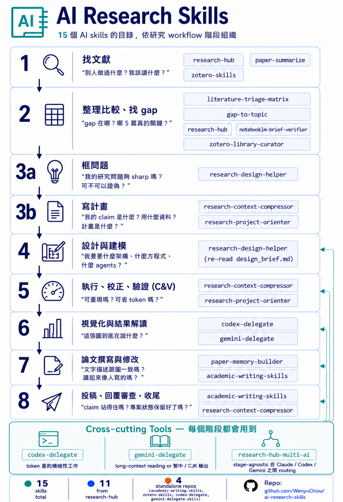

# AI Research Skills

[](LICENSE)

> 13 個 Claude Code skills，covers 常見的研究任務——文獻整理、研究
> design、專案 context、論文撰寫、多 AI delegation。

語言：[English](README.md) | [繁中](README.zh-TW.md)



**你會拿到什麼：** 1 個 Claude Code marketplace 統一安裝，5 個 plugin
共 13 個 skill。Per-skill testing 細節見
[docs/verification.md](docs/verification.md)。

**適合誰：** 研究生、博士生、博士後、研究人員、研究工程師、圖書館員，
以及在實際研究流程中把 AI 拉進來的研究支援人員。

---

## 安裝

前置條件：Claude Code（https://claude.ai/code）。

Skills 是放在 `~/.claude/skills/` 底下的 Markdown 指令檔
（`SKILL.md`）。Claude Code 看到請求符合 skill 的描述就自動讀進來。

下面每一步是**累加的**——做到哪裡停都可以，已裝的就能用。每個 code
block 右上角會出現 GitHub 的複製按鈕。

### Step 1 — Marketplace plugin（從這裡開始）

請在 terminal 執行，不要在互動式 `/plugin` UI 裡跑：

```bash
claude plugin marketplace add WenyuChiou/ai-research-skills
claude plugin install research-workspace@ai-research-skills
```

**立刻可用的 skill**（純 Claude 推理 + 寫檔，不需要外部設定）：
`literature-triage-matrix`、`research-design-helper`、
`research-context-compressor`、`research-project-orienter`、
`paper-memory-builder`，加上 `notebooklm-brief-verifier`（Manual fallback 模式）。13 個裡先 6 個。

> Step 1 也會裝 `research-hub`、`research-hub-multi-ai`、跟
> `zotero-library-curator` 的 apply-cleanup 那半。沒有 `research-hub`
> Python CLI 在 PATH 上時，這幾個 skill 會印出
> `pip install research-hub-pipeline` 提示，不會幻覺輸出——要完整啟用
> 看 Step 5。

> **想一次裝完 5 個 plugin？** 跑完 step 1 + 下面 step 2-4 之後，也
> 可以用這支 helper script 把所有 install 指令批次跑一遍：
>
> ```bash
> bash scripts/install-all.sh                # macOS / Linux / git-bash
> pwsh scripts/install-all.ps1               # Windows PowerShell
> ```
>
> 這個 script 就是把下面那些 `claude plugin install` 指令包成 loop。
> 外部前置（Zotero local API、Codex / Gemini CLI binary）還是要照
> step 3 / step 4 的說明手動處理。

### Step 2 — 寫論文

```bash
claude plugin install academic-writing-skills@ai-research-skills
```

**+ `academic-writing-skills`**——banned-word audit、claim-evidence
檢查、journal format、reviewer response。

### Step 3 — Zotero

先在 Zotero desktop（[下載](https://www.zotero.org/download/)）：Edit →
Settings → Advanced → 勾 **「Allow other applications on this computer
to communicate with Zotero」**。（Web API key 替代方案：看
[zotero-skills README](https://github.com/WenyuChiou/zotero-skills#readme)。）

```bash
claude plugin install zotero-skills@ai-research-skills
```

**+ `zotero-skills`**（完整 CRUD）和 **`zotero-library-curator`**
（audit + cleanup 提案；本身在第 1 步已經有，這步把它從 preview-only
變成「能真的執行修改」）。

### Step 4 — 多 CLI delegation

先裝 CLI binary（安裝指引在上游 README）：[Codex CLI](https://github.com/WenyuChiou/codex-delegate#readme)、
[Gemini CLI](https://github.com/WenyuChiou/gemini-delegate-skill#readme)。

```bash
claude plugin install codex-delegate@ai-research-skills
claude plugin install gemini-delegate@ai-research-skills
```

**+ `codex-delegate`**（把 token-heavy 的 code 工作交給 Codex CLI）、
**+ `gemini-delegate`**（長 context / CJK 輸出走 Gemini CLI）。

### Step 5 — 文獻 pipeline 自動化

```bash
pip install research-hub-pipeline
research-hub setup
```

`research-hub setup` 跑互動式 onboarding，會問你要連 Zotero / Obsidian
/ NotebookLM 哪幾個，不用事先選任何選項。

**+ `research-hub`**（論文搜尋、ingest、NotebookLM 上傳）、
**`research-hub-multi-ai`**（delegation orchestration）。也會把第 1-2
步如果你跳過的補裝。

### 驗證

```bash
claude plugin list
ls ~/.claude/skills/
```

**其他注意：**

- `/plugin marketplace info` 顯示 `(no content)` 不是錯誤——`info`
  在 Claude Code 2.1.119 不是支援的 subcommand。
- 互動式 `/plugin install` 有時會改走 SSH，本機沒有 GitHub SSH key
  就會失敗；terminal 的 `claude plugin install ...` 走 HTTPS，沒有
  這個問題。
- 5 個 plugin（research-workspace + 4 個 standalone）都從這個
  catalog 的 marketplace 透過 `claude plugin install` 安裝。
  marketplace schema 跟 per-plugin coverage 詳情見
  [.claude-plugin/README.md](.claude-plugin/README.md)。

---

## 在 Claude Code 之外用這些 skills

`claude plugin install` 那條路徑只有 Claude Code 認得。SKILL.md 本身
就是 Markdown，可以給 Codex CLI、Gemini CLI、Cursor、Windsurf 或任何
吃 context file 的 AI assistant 用。代價是失去 Claude Code 的
auto-trigger（你描述需求它會自己挑對的 skill）——在其他 host 上你要
明確指出要用哪個 SKILL.md。

### 1. 拿原始檔

```bash
git clone https://github.com/WenyuChiou/research-hub
git clone https://github.com/WenyuChiou/academic-writing-skills
git clone https://github.com/WenyuChiou/zotero-skills
git clone https://github.com/WenyuChiou/codex-delegate
git clone https://github.com/WenyuChiou/gemini-delegate-skill
```

每個 repo 的 SKILL.md（連同 `references/`）都在
`skills/<plugin-name>/` 底下。research-hub 有 9 份；其他 4 個各 1 份。

### 2. 各 host 載入方式

| Host | 怎麼載入 SKILL.md |
|---|---|
| **Codex CLI** | `codex exec --full-auto -C /repo "$(cat path/to/SKILL.md)\n\n現在做 X..."`，或寫一份 `.ai/codex_task.md` 開頭塞 SKILL.md 內容 |
| **Gemini CLI** | `--system-prompt-file path/to/SKILL.md`，或放進 project context |
| **Cursor / Windsurf** | 把 SKILL.md（或內容）丟到 `.cursor/rules/` 或對應 rules 目錄 |
| **通用 API** | 把 SKILL.md 當 system prompt 用 |
| **其他 AI** | 把 SKILL.md 相關段落貼進你的 prompt |

### 3. 哪些 skill 在 Claude Code 之外比較合理

- 5 個純推理 skill（`literature-triage-matrix`、
  `research-design-helper`、`research-context-compressor`、
  `research-project-orienter`、`paper-memory-builder`）任何 AI 都能
  跑——它們講的是 workflow + 輸出格式，不依賴 Claude 特定機制。
- `academic-writing-skills` 任何 AI 能讀檔（`.paper/`、journal_format.md）就行。
- `notebooklm-brief-verifier` 的 Manual fallback 模式哪都能跑。
- `zotero-skills` 任何 AI 能呼叫 Zotero local / Web API 就能用——它
  主要是 API routing reference，不是 Claude 特性。
- `codex-delegate` / `gemini-delegate` 是 **Claude 對外 delegate**
  時用的；如果你直接用 Codex 或 Gemini，這兩個不太需要。
- `research-hub` 跟 `research-hub-multi-ai` 不論用哪個 AI 都要先
  `pip install research-hub-pipeline`。

---

## 怎麼用

裝完之後，skills 會在你 Claude Code 的請求符合 skill 的描述時**自動觸發**。
**你不用記 skill 名字**——描述你想做什麼，Claude Code 會挑對的 skill。

### 範例：你怎麼說 → 哪個 skill 會啟動

| 你說... | 啟動的 skill |
|---|---|
| 「比較這 5 篇論文的 method、data、limitations」 | `literature-triage-matrix` |
| 「audit 我的 Zotero library 找重複跟 orphan tags」 | `zotero-library-curator` |
| 「在我開始 coding 之前先帶我走過研究 design」 | `research-design-helper` |
| 「驗證這份 NotebookLM brief 對應 source bundle」 | `notebooklm-brief-verifier` |
| 「從 manuscript draft 建一份 paper memory」 | `paper-memory-builder` |
| 「audit 我這段文字有沒有 banned words 跟 overclaim」 | `academic-writing-skills` |
| 「依照這些 reviewer 意見產出 point-by-point 回覆」 | `academic-writing-skills` |
| 「audit 我的 figure caption 跟內文一致性」 | `academic-writing-skills` |
| 「壓縮這個 project context 給未來 AI session 用」 | `research-context-compressor` |
| 「Orient 一下——這個 repo 在做什麼？」 | `research-project-orienter` |
| 「這個 task 是 code-heavy——交給 Codex」 | `codex-delegate` |
| 「把這份 brief 翻成繁中、需要長 context」 | `gemini-delegate` |

### Skill 沒自動觸發怎麼辦

如果 Claude Code 沒挑到對的 skill，明說 skill 名字：

> 「用 `literature-triage-matrix` 比較這 5 篇論文。」

---

## 找到你的起點

如果你想按目標挑 skill subset 而不是裝全部，對到你眼前的目標就好。

| 你眼前的目標 | 你會用到的 skills |
|---|---|
| **找文獻、比較文獻** | [`research-hub`](https://github.com/WenyuChiou/research-hub/blob/master/skills/research-hub/SKILL.md) + [`literature-triage-matrix`](https://github.com/WenyuChiou/research-hub/blob/master/skills/literature-triage-matrix/SKILL.md) |
| **寫論文 / 改稿** | [`paper-memory-builder`](https://github.com/WenyuChiou/research-hub/blob/master/skills/paper-memory-builder/SKILL.md) + [`academic-writing-skills`](https://github.com/WenyuChiou/academic-writing-skills/blob/main/skills/academic-writing-skills/SKILL.md) |
| **管理研究專案 / Zotero library** | [`research-design-helper`](https://github.com/WenyuChiou/research-hub/blob/master/skills/research-design-helper/SKILL.md) + [`research-context-compressor`](https://github.com/WenyuChiou/research-hub/blob/master/skills/research-context-compressor/SKILL.md) + [`zotero-library-curator`](https://github.com/WenyuChiou/research-hub/blob/master/skills/zotero-library-curator/SKILL.md) |

> **協助別人用 AI 做研究**（圖書館員 / RA / 指導者）？不用裝——直接把
> 這個 README、[docs/install.zh-TW.md](docs/install.zh-TW.md)、
> [docs/skill-directory.zh-TW.md](docs/skill-directory.zh-TW.md)、
> [docs/researcher-workflow-checklist.zh-TW.md](docs/researcher-workflow-checklist.zh-TW.md)
> 轉給對方就好。Per-skill testing 結果在
> [docs/verification.md](docs/verification.md)（英文）。
>
> **沒對到你的目標？** 完整 8 階段研究 pipeline 在
> [docs/pipeline.zh-TW.md](docs/pipeline.zh-TW.md)，找到你的階段就裝
> 對應的 skill。
>
> **想看 skill 串起來用實際長什麼樣？** [docs/demo-walkthrough.md](docs/demo-walkthrough.md)
> 用一份 5 篇真論文的 test corpus，把 7 個 skill 從搜尋到稿件 audit
> 走完，每一步都連到實際產出的 artifact 檔案（英文）。

---

## 全部 13 個 Skills

<details>
<summary><b>來自 <code>research-hub</code>（9 個）</b>——一次安裝全部到位</summary>

- [`research-hub`](https://github.com/WenyuChiou/research-hub/blob/master/skills/research-hub/SKILL.md)：在 Zotero / Obsidian / NotebookLM 之間搜尋、匯入、整理論文。*(階段 1、2)*
- [`literature-triage-matrix`](https://github.com/WenyuChiou/research-hub/blob/master/skills/literature-triage-matrix/SKILL.md)：依 method、data、claim、limitation 做比較表。*(階段 2)*
- [`notebooklm-brief-verifier`](https://github.com/WenyuChiou/research-hub/blob/master/skills/notebooklm-brief-verifier/SKILL.md)：把 NotebookLM brief 對回 source bundle 做驗證。*(階段 2)*
- [`zotero-library-curator`](https://github.com/WenyuChiou/research-hub/blob/master/skills/zotero-library-curator/SKILL.md)：audit Zotero library，提整理計畫（preview only）。*(階段 2)*
- [`research-design-helper`](https://github.com/WenyuChiou/research-hub/blob/master/skills/research-design-helper/SKILL.md)：Socratic 對話走過 RQ → mechanism → identifiability → validation → risk。*(階段 3a、4)*
- [`research-context-compressor`](https://github.com/WenyuChiou/research-hub/blob/master/skills/research-context-compressor/SKILL.md)：用 `.research/` manifest 讓未來 AI session 不必重新掃 repo。*(階段 3b、5、8)*
- [`research-project-orienter`](https://github.com/WenyuChiou/research-hub/blob/master/skills/research-project-orienter/SKILL.md)：讀那些 manifest，快速產生 orientation 摘要。*(階段 3b、5)*
- [`research-hub-multi-ai`](https://github.com/WenyuChiou/research-hub/blob/master/skills/research-hub-multi-ai/SKILL.md)：stage-agnostic、按 task 性質做 Claude / Codex / Gemini routing。*(Cross-cutting)*
- [`paper-memory-builder`](https://github.com/WenyuChiou/research-hub/blob/master/skills/paper-memory-builder/SKILL.md)：產出 `.paper/claims.yml` 與 `.paper/figures.yml` 給寫作流程用。*(階段 7)*

</details>

<details>
<summary><b>獨立 repos（4 個）</b>——個別 git clone</summary>

- [`academic-writing-skills`](https://github.com/WenyuChiou/academic-writing-skills/blob/main/skills/academic-writing-skills/SKILL.md)：manuscript 修改、claim-evidence audit、banned-word／humanize、journal format、reviewer response。*(階段 7、8)*
- [`zotero-skills`](https://github.com/WenyuChiou/zotero-skills/blob/master/skills/zotero-skills/SKILL.md)：完整 Zotero CRUD、batch metadata、library maintenance。*(階段 1、2、7)*
- [`codex-delegate`](https://github.com/WenyuChiou/codex-delegate/blob/master/skills/codex-delegate/SKILL.md)：把程式重的工作從 Claude 交給 Codex CLI。*(Cross-cutting，也用於階段 6)*
- [`gemini-delegate`](https://github.com/WenyuChiou/gemini-delegate-skill/blob/master/skills/gemini-delegate/SKILL.md)：把長 context、多語、CJK 工作從 Claude 交給 Gemini CLI。*(Cross-cutting，也用於階段 6、7)*

</details>

### 一個 workflow 順序提醒

`research-project-orienter` 讀 `.research/` manifest 比較快；沒有的話
會 fallback scan `README.md` + `docs/`（比較慢）。要重複用 orientation
的話，先跑 `research-context-compressor` 產出 manifest。

---

## Testing

Per-skill testing 矩陣與可重現的 test-corpus 證據：
[docs/verification.md](docs/verification.md)。

---

## 狀態與授權

輕量 catalog。每個 skill 由各自的 canonical repo 維護——這個 catalog
是索引，不是 monorepo。

授權：MIT。歡迎 contribution——open issue 或 PR。新 skill 提案請鎖定
`research-hub`（workflow 整合）或一個獨立 repo（單一目的、深度的
CRUD）。
