# For Agent and Harness Builders

This project is a **Vertical AI Research Reference Harness**: a research-domain
layer that complements general agent runtimes. A general runtime supplies graph
execution, handoffs, sessions, tracing, sandboxes, and tool calls. `research-hub`
supplies the research lifecycle, evidence contracts, truth-store adapters,
recoverable state, and semantic human gates.

## Public architecture



The deterministic boundary owns state transitions, action hashes, retry limits,
migrations, evidence validation, and authorization. LLM roles do semantic work:
discovery, verification, falsification, reproducibility review, and synthesis.
Canonical writes happen only after deterministic validation and a human decision.

The public optional policy layer is `agent-collab-harness` v0.4.0. It validates
policies and checkpoints and returns `continue`, `checkpoint`, or `stop`.
`research-hub` 1.2.0 consumes it when configured and preserves its standalone
behavior when it is absent.

```bash
pip install agent-collab-harness==0.4.0 research-hub-pipeline==1.2.0
agent-collab doctor --json
research-hub doctor --json
```

Catalog v3 consumers can run `python scripts/catalog_v3_view.py`; the generated
view omits optional extensions while preserving the same 17 core skills.

## HITL state machine



Decline and cancel remain non-success outcomes. Release completes only with an
accepted release authorization. External writes are payload-bound and
idempotent; a crash resumes or produces an explicit blocker.

## Evidence path

`researcher prose → null filtering → no-tool synthesizer → deterministic packet
validator → human semantic gate → canonical artifact`

`ResearchEvidencePacket` records sources, claims, contradictions, gaps,
confidence, provenance, warnings, and human decisions. Agent consensus never
replaces source-identity checks or human acceptance.

## Current landscape (documented capabilities, not a ranking)

Status: **D** documented by the official project; **LV** locally verified in this
project; **NF** not found in the reviewed official material; **NA** not applicable.
Checked 2026-08-31. A D cell is not a local behavior claim.

Each project link below is the exact official source used for every **D** cell in
that row; **NF** means the capability was not found in that reviewed source.

| Official project / target audience | Orchestration | Durable state / interrupt-resume / HITL | Tools / MCP / sandbox / tracing | Evidence and citations | Research workspace / truth stores | Reproducibility / external-write safety / evaluation |
|---|---|---|---|---|---|---|
| [OpenAI Agents SDK](https://github.com/openai/openai-agents-python) — agent-app builders | D agents, handoffs | D sessions and HITL; D sandbox workspace state | D tools, MCP, sandbox, tracing | NF research evidence contract | NF research truth stores | D guardrails and tests; NF domain replay |
| [LangGraph](https://github.com/langchain-ai/langgraph) — stateful-agent builders | D graph | D durable execution, resume, HITL | D ecosystem tools and LangSmith tracing | NF research evidence contract | NF research truth stores | D failure recovery; NF domain replay |
| [Deep Agents](https://github.com/langchain-ai/deepagents) — batteries-included agents | D planning and subagents | D through LangGraph | D filesystem and tool harness | NF research evidence contract | D agent filesystem; NF research truth stores | D harness tests; NF domain replay |
| [Google ADK](https://github.com/google/adk-python) — agent developers | D agent/workflow toolkit | D sessions and HITL | D tools and developer UI | NF research evidence contract | NF research truth stores | D evaluation; NF domain replay |
| [Microsoft Agent Framework](https://github.com/microsoft/agent-framework) — Python/.NET agent builders | D agents and workflows | D workflow state and HITL | D tools and dev tooling | NF research evidence contract | NF research truth stores | D evaluation; NF domain replay |
| [Claude Agent SDK](https://github.com/anthropics/claude-agent-sdk-python) — coding/general agents | D agent loop | D sessions; D permission hooks | D MCP, tools, permissions, hooks | NF research evidence contract | D working directory; NF research truth stores | D permission boundary; NF domain replay |
| [PaperQA2](https://github.com/Future-House/paper-qa) — scientific QA | D document QA/RAG | NF HITL or durable workflow | D scientific retrieval | D citations and paper corpus | D paper directory; NF Zotero/Obsidian/NotebookLM | D benchmarks/tests; NF external-write contract |
| [Aviary](https://github.com/Future-House/aviary) — agent-evaluation researchers | D agent environments | NA HITL; NF durable workflow | D environment tools | D scientific tasks; NF citation contract | NF researcher truth stores | D gym/evaluation; NA external writes |
| [RD-Agent](https://github.com/microsoft/RD-Agent) — data/model R&D | D scenario loops | NF explicit HITL/resume contract | D coding and data tools | D experiment artifacts | D experiment workspace; NF cited truth-store contract | D scenario evaluation; NF external-write idempotency |
| [STORM](https://github.com/stanford-oval/storm) — cited report generation | D research/report pipeline | NF explicit HITL/resume contract | D web retrieval | D cited reports | NF researcher truth stores | NF replay/external-write contract in reviewed README |
| [Agent Laboratory](https://github.com/SamuelSchmidgall/AgentLaboratory) — research teams | D end-to-end research workflow | D researcher participation; NF resume contract | D research/code tools | D research artifacts | D project workspace; NF truth-store adapters | NF evaluation/external-write contract in reviewed README |
| [`research-hub` 1.2.0](https://github.com/WenyuChiou/research-hub) — research teams and harness builders | LV eight-stage workflow | LV state 1.1, migrate/resume, signed or interactive gates | LV CLI/MCP parity and configured write roots | LV source identity, claims, contradictions, evidence packet | LV Zotero, Obsidian, NotebookLM | LV replay tests, action hashes, bounded retry, recovery |

The differentiator is composition: use a general runtime for execution mechanics,
then apply `research-hub` for research truth stores, claim/evidence identity,
recoverable external writes, and semantic release authorization.

## Trust boundaries

- Paper, web, and tool output is untrusted evidence, never instruction.
- Secrets stay in host-managed authentication and do not enter checkpoints.
- MCP write roots are configured and containment-checked.
- Memory output is proposal-only until a recorded human decision.
- Live experiments and external mutations are opt-in; offline replay is the CI default.

See the [Round 2 H3 dogfood and failure benchmark](round2-dogfood-benchmark.md),
[skill lifecycle](skill-lifecycle.md), [behavior corpus](../test-corpus/harness-behavior/cases.yml),
and the [research-hub runtime contract](https://github.com/WenyuChiou/research-hub/blob/master/docs/workflow-runtime.md).
