# 給 Agent 與 Harness 建構者

本專案定位為 **垂直 AI 研究參考 Harness（Vertical AI Research Reference
Harness）**，是通用 agent runtime 的研究領域層。通用 runtime 提供 graph、
handoff、session、tracing、sandbox 與 tool call；`research-hub` 提供研究生命週期、
證據契約、truth-store adapter、可恢復狀態與語意人類閘門。

## 公開架構



Deterministic boundary 負責狀態轉移、action hash、retry 上限、migration、
evidence validation 與 authorization。LLM roles 負責 discovery、verification、
falsification、reproducibility review 與 synthesis。只有 deterministic validator
與人類決策都通過後，才寫入 canonical artifact。

公開的選配 policy layer 是 `agent-collab-harness` v0.4.0；`research-hub`
1.2.0 在設定後使用它，未安裝時仍保留獨立運作能力。Policy evaluation 會回傳
`continue`、`checkpoint` 或 `stop`。

```bash
pip install agent-collab-harness==0.4.0 research-hub-pipeline==1.2.0
agent-collab doctor --json
research-hub doctor --json
```

舊 v3 consumer 可執行 `python scripts/catalog_v3_view.py`；輸出會省略選配
extension，17 個核心 skills 完全不變。

## HITL 狀態機



Decline 與 cancel 永遠不是 success。Release 只有在 release authorization 被
accept 後才完成。外部寫入綁定完整 payload hash，crash 後必須 resume、reconcile
或產生明確 blocker。

## 證據路徑

`researcher prose → 過濾 null → no-tool synthesizer → deterministic packet
validator → human semantic gate → canonical artifact`

`ResearchEvidencePacket` 記錄 sources、claims、contradictions、gaps、confidence、
provenance、warnings 與 human decisions。Agent 多數決不能取代來源 identity
驗證或人類接受決策。

## 當前 landscape（文件能力，不是排名）

狀態：**D** 官方文件有記載；**LV** 本專案本地驗證；**NF** 官方材料未找到；
**NA** 不適用。檢查日為 2026-08-31；D 不代表本專案已做行為實測。

下表每一列的 project link 是該列所有 **D** cell 的官方來源；**NF** 表示在該次
檢查的官方來源中未找到此能力。

| 官方專案 / 受眾 | Orchestration | Durable state / interrupt-resume / HITL | Tools / MCP / sandbox / tracing | Evidence 與 citations | Research workspace / truth stores | Reproducibility / external-write safety / evaluation |
|---|---|---|---|---|---|---|
| [OpenAI Agents SDK](https://github.com/openai/openai-agents-python) — agent app 建構者 | D agents、handoffs | D sessions 與 HITL；D sandbox workspace state | D tools、MCP、sandbox、tracing | NF 研究證據契約 | NF 研究 truth stores | D guardrails 與 tests；NF domain replay |
| [LangGraph](https://github.com/langchain-ai/langgraph) — stateful agent 建構者 | D graph | D durable execution、resume、HITL | D ecosystem tools 與 LangSmith tracing | NF 研究證據契約 | NF 研究 truth stores | D failure recovery；NF domain replay |
| [Deep Agents](https://github.com/langchain-ai/deepagents) — batteries-included agents | D planning 與 subagents | D（透過 LangGraph） | D filesystem 與 tool harness | NF 研究證據契約 | D agent filesystem；NF 研究 truth stores | D harness tests；NF domain replay |
| [Google ADK](https://github.com/google/adk-python) — agent developers | D agent/workflow toolkit | D sessions 與 HITL | D tools 與 developer UI | NF 研究證據契約 | NF 研究 truth stores | D evaluation；NF domain replay |
| [Microsoft Agent Framework](https://github.com/microsoft/agent-framework) — Python/.NET agent 建構者 | D agents 與 workflows | D workflow state 與 HITL | D tools 與 dev tooling | NF 研究證據契約 | NF 研究 truth stores | D evaluation；NF domain replay |
| [Claude Agent SDK](https://github.com/anthropics/claude-agent-sdk-python) — coding/general agents | D agent loop | D sessions；D permission hooks | D MCP、tools、permissions、hooks | NF 研究證據契約 | D working directory；NF 研究 truth stores | D permission boundary；NF domain replay |
| [PaperQA2](https://github.com/Future-House/paper-qa) — scientific QA | D document QA/RAG | NF HITL 或 durable workflow | D scientific retrieval | D citations 與 paper corpus | D paper directory；NF Zotero/Obsidian/NotebookLM | D benchmarks/tests；NF external-write contract |
| [Aviary](https://github.com/Future-House/aviary) — agent evaluation 研究者 | D agent environments | NA HITL；NF durable workflow | D environment tools | D scientific tasks；NF citation contract | NF researcher truth stores | D gym/evaluation；NA external writes |
| [RD-Agent](https://github.com/microsoft/RD-Agent) — data/model R&D | D scenario loops | NF 明確 HITL/resume contract | D coding 與 data tools | D experiment artifacts | D experiment workspace；NF cited truth-store contract | D scenario evaluation；NF external-write idempotency |
| [STORM](https://github.com/stanford-oval/storm) — cited report generation | D research/report pipeline | NF 明確 HITL/resume contract | D web retrieval | D cited reports | NF researcher truth stores | NF replay/external-write contract（官方 README） |
| [Agent Laboratory](https://github.com/SamuelSchmidgall/AgentLaboratory) — research teams | D 端到端 research workflow | D researcher participation；NF resume contract | D research/code tools | D research artifacts | D project workspace；NF truth-store adapters | NF evaluation/external-write contract（官方 README） |
| [`research-hub` 1.2.0](https://github.com/WenyuChiou/research-hub) — research teams 與 harness 建構者 | LV 八階段 workflow | LV state 1.1、migrate/resume、signed 或 interactive gates | LV CLI/MCP parity 與 configured write roots | LV source identity、claims、contradictions、evidence packet | LV Zotero、Obsidian、NotebookLM | LV replay tests、action hashes、bounded retry、recovery |

強項在於組合：通用 runtime 處理 execution mechanics；`research-hub` 處理研究
truth stores、claim/evidence identity、可恢復外部寫入與語意 release authorization。

## Trust boundaries

- Paper、web 與 tool output 都是不可信證據，不是指令。
- Secrets 留在 host-managed authentication，不寫入 checkpoint。
- MCP write root 必須設定並驗證 containment。
- Memory output 只能是 proposal，需明確人類決策才能進 canonical memory。
- Live experiment 與外部 mutation 為 opt-in；CI 預設只跑 offline replay。

另見 [skill lifecycle](skill-lifecycle.zh-TW.md)、[behavior corpus](../test-corpus/harness-behavior/cases.yml)
與 [research-hub runtime contract](https://github.com/WenyuChiou/research-hub/blob/master/docs/workflow-runtime.md)。
